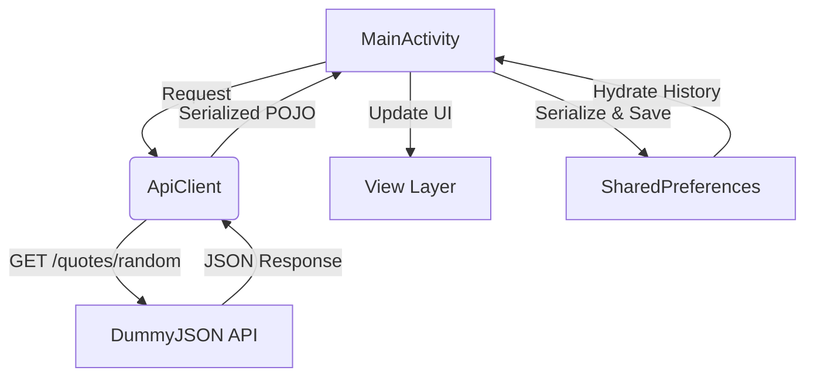

# LifeReminder - Technical Documentation

[](https://kotlinlang.org/)
[](https://developer.android.com/)
[](https://square.github.io/retrofit/)
[](https://m3.material.io/)

LifeReminder is a native Android application engineered to demonstrate asynchronous REST API consumption, local state persistence, and dynamic UI rendering within the Kotlin ecosystem.

## 🛠 Technical Stack

- **Platform**: Android (Target SDK 35)
- **Language**: Kotlin
- **Networking Layer**: 
  - **Retrofit 2**: Type-safe HTTP client for API interactions.
  - **Gson**: JSON serialization/deserialization.
- **UI Framework**: 
  - Native XML Layouts.
  - Material components (CardView, ConstraintLayout).
  - Dynamic Gradient rendering engine via `GradientDrawable`.
- **Data Persistence**: 
  - **SharedPreferences**: Local storage utilized for quote history serialization using JSON arrays.
- **Concurrency**: Callback-based asynchronous networking (`enqueue`).

## 🏗 System Architecture

The application follows a standard monolithic activity architecture with a centralized Singleton for network management.

### Data Flow Diagram



### Component Breakdown

| Component | Responsibility | Technical Implementation |
| :--- | :--- | :--- |
| `ApiClient` | Network abstraction | Singleton pattern with Lazy initialization of `Retrofit` instance. |
| `ApiService` | API Endpoint definition | Retrofit Interface utilizing `@GET` annotations. |
| `QuoteResponse` | Data Modeling | Kotlin Data Class for the DummyJSON Quote schema. |
| `MainActivity` | Controller & View Logic | Lifecycle management, Event handling, and dynamic View inflating. |

## 🚀 Key Engineering Features

### 1. Dynamic UI & Visual Algorithms
The application implements an adaptive UI strategy through a randomized gradient generation algorithm. This ensures a unique visual context for each fetched quote by programmatically manipulating `GradientDrawable` objects.

### 2. History Persistence Pattern
Unlike simple primitive storage, LifeReminder implements a custom serialization pattern:
1. **Model**: Quotes are stored as `Pair<String, String>`.
2. **Serialization**: The `historyList` is converted into a `JSONArray`.
3. **Persistence**: The stringified JSON is stored in `SharedPreferences`.
4. **Hydration**: On application startup, the JSON is parsed back into memory-safe Kotlin objects.

### 3. Native Integration
- **Implicit Intents**: Leverages `Intent.ACTION_SEND` for system-wide content sharing.
- **Clipboard Service**: Direct integration with `CLIPBOARD_SERVICE` for low-friction data portability.
- **Edge-to-Edge**: Implements `enableEdgeToEdge()` for modern immersive display utilization.

## 📡 API Reference

The application interfaces with the **DummyJSON API**.

### Endpoint: `GET /quotes/random`

**Response Structure (Mapped to `QuoteResponse.kt`):**
```json
{
  "id": 1,
  "quote": "Your heart is the size of an ocean. Go find yourself in its hidden depths.",
  "author": "Rumi"
}
```

---

> [!NOTE]
> This project is designed as a technical demonstration of core Android development patterns and does not require complex dependency injection or massive architectural overhead, prioritizing performance and readability.
