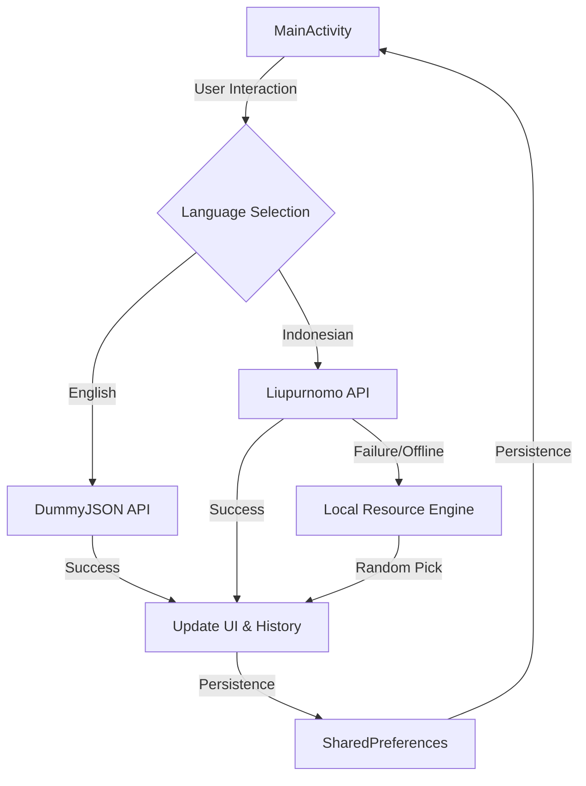

# LifeReminder - Technical Documentation

LifeReminder is a native Android application engineered to demonstrate asynchronous REST API consumption, multi-source data strategies, local state persistence, and dynamic UI rendering within the Kotlin ecosystem.

## 🛠 Technical Stack

- **Platform**: Android (Target SDK 35)
- **Language**: Kotlin 2.0 (K2 Compiler)
- **Networking Layer**: 
  - **Retrofit 2**: Type-safe HTTP client for API interactions.
  - **Gson**: JSON serialization/deserialization.
- **UI Framework**: 
  - Native XML Layouts with Material 3 components.
  - Dynamic Gradient rendering engine via `GradientDrawable`.
- **Data Persistence**: 
  - **SharedPreferences**: Local storage for quote history utilizing JSON serialization.
- **Concurrency**: Callback-based asynchronous networking (`enqueue`).

## 🏗 System Architecture

The application implements a **Resilient Data Strategy** that handles multiple API sources and provides a seamless local fallback mechanism.

### Data Flow Diagram

### Component Breakdown

| Component | Responsibility | Technical Implementation |
| :--- | :--- | :--- |
| `ApiClient` | Network abstraction | Singleton pattern with Lazy initialization. |
| `ApiService` | API Endpoint definition | Retrofit Interface with dynamic URL support for Indonesian quotes. |
| `QuoteResponse` | EN Data Model | Data Class for DummyJSON schema. |
| `IndoQuoteResponse` | ID Data Model | Data Class for Indonesian API schema with `@SerializedName`. |
| `IndonesianQuotes`| Local Fallback | Singleton providing pre-bundled quote resources for offline resiliency. |
| `MainActivity` | Controller | Lifecycle management, language toggling, and history serialization logic. |

## 🚀 Key Engineering Features

### 1. Resilient Quote Engine
The app utilizes a triple-layer data fetch strategy:
1. **Primary Remote**: Fetches fresh content from public REST APIs.
2. **Context-Aware API**: Switches endpoints based on user language (ID/EN).
3. **Local Fallback**: If networking fails or API results are null, the app instantly hydrates the UI using a local resource engine (`IndonesianQuotes`), ensuring zero-downtime user experience.

### 2. Multi-Mode History Serialization
Unlike simple primitive storage, LifeReminder implements a custom serialization pattern:
- **Serialization**: The `historyList` (List of Pairs) is converted into a `JSONArray`.
- **Persistence**: Stringified JSON is stored via `SharedPreferences`.
- **Hydration**: On startup, the system parses the JSON back into memory-safe Kotlin objects.

### 3. Dynamic UI & Visual Algorithms
Implements an adaptive UI strategy through a randomized gradient generation algorithm. It programmatically manipulates `GradientDrawable` objects to ensure a unique visual context for every quote interaction.

### 4. Native System Integration
- **Implicit Intents**: `Intent.ACTION_SEND` for system-wide content sharing.
- **Clipboard Service**: Direct integration with `CLIPBOARD_SERVICE`.
- **Edge-to-Edge**: Implements `enableEdgeToEdge()` for immersive modern display support.

## 📡 API Reference

### English (Global)
- **Source**: `https://dummyjson.com/`
- **Endpoint**: `GET /quotes/random`

### Indonesian (Localized)
- **Source**: `https://quotes.liupurnomo.com/`
- **Endpoint**: `GET /api/quotes/random`

---

> [!NOTE]
> This project is designed as a technical demonstration of core Android development patterns, focusing on **Network Resiliency** and **State Persistence** without the overhead of complex DI frameworks.
